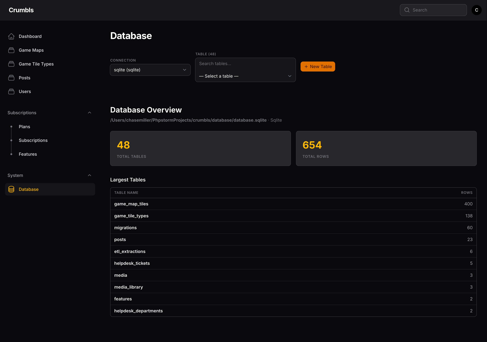
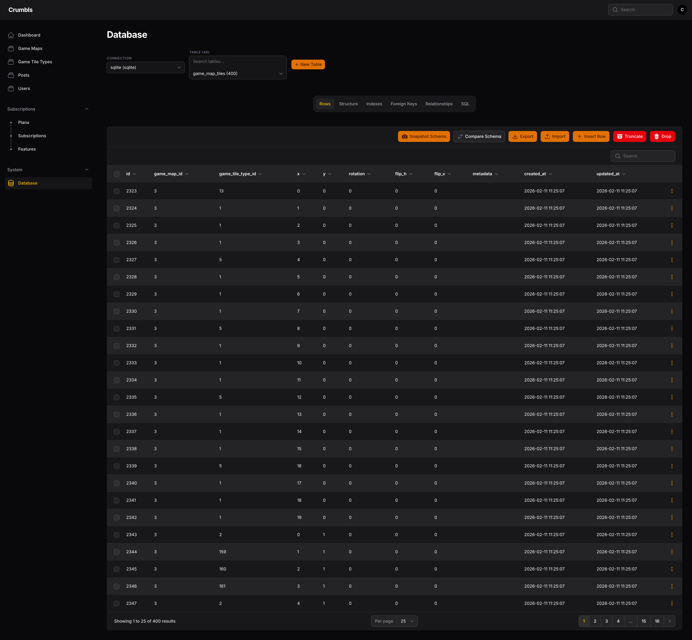

# Filament Database

A phpMyAdmin-style database manager for [Laravel Filament](https://filamentphp.com). Browse tables, edit rows, manage schema, run SQL — all from your Filament admin panel.

Supports **SQLite**, **MySQL**, and **PostgreSQL**.

## Screenshots

### Database Overview


### Table Browser


## Requirements

- PHP 8.2+
- Laravel 12+
- Filament 4+ (5 recommended)

## Installation

```bash
composer require crumbls/filament-database
```

## Setup

Register the plugin in your Filament panel provider:

```php
use Crumbls\FilamentDatabase\FilamentDatabasePlugin;

public function panel(Panel $panel): Panel
{
    return $panel
        // ...
        ->plugins([
            FilamentDatabasePlugin::make(),
        ]);
}
```

## Features

- **Database overview** — stats dashboard with table counts, row counts, and largest tables at a glance
- **Connection switcher** — hot-swap between database connections with health checking
- **Table browser** — searchable table list with row counts, one-click selection
- **Row CRUD** — paginated rows with sort, search, inline edit, insert, delete
- **Bulk operations** — select multiple rows for bulk delete or export
- **Copy row as** — copy any row as PHP array, JSON, SQL INSERT, or Laravel factory format
- **Structure viewer** — columns with types, nullable, defaults, and inline editing
- **Column management** — add, rename, modify, and drop columns
- **Index viewer** — all indexes with columns and uniqueness
- **Foreign key viewer** — constraints with ON UPDATE/DELETE actions
- **Relationships tab** — visual map of incoming and outgoing foreign key relationships
- **SQL runner** — execute raw queries with tabular results, query history, and Cmd/Ctrl+Enter shortcut
- **Query EXPLAIN** — EXPLAIN/ANALYZE support for MySQL, PostgreSQL, and SQLite
- **Schema snapshots** — capture your entire database schema as JSON, compare against previous snapshots with color-coded diffs
- **Migration generator** — generate Laravel migration code from schema diffs, copy or save directly to `database/migrations/`
- **Export** — download table data as CSV, JSON, or SQL INSERT statements
- **Import** — upload CSV files with automatic column mapping
- **Table operations** — create, truncate, drop tables with confirmation dialogs
- **Dark mode** — full support via Filament CSS variables
- **Audit logging** — optional query and change logging

## Configuration

Publish the config:

```bash
php artisan vendor:publish --tag=filament-database-config
```

### Plugin API

```php
FilamentDatabasePlugin::make()
    // Access control
    ->authorize(fn () => auth()->user()->is_admin)
    ->onlyForEmails(['admin@example.com'])

    // Connections
    ->connections(['mysql', 'sqlite'])
    ->excludeConnections(['pgsql'])
    ->defaultConnection('mysql')

    // Safety
    ->readOnly()
    ->preventDestructive()
    ->requireConfirmation()

    // Table visibility
    ->hideTables(['password_resets', 'failed_jobs'])
    ->showOnlyTables(['users', 'posts'])

    // SQL runner
    ->disableQueryRunner()
    ->queryRunnerReadOnly()

    // UI
    ->navigationGroup('System')
    ->navigationIcon('heroicon-o-circle-stack')
    ->navigationSort(100)
    ->navigationLabel('Database')
    ->rowsPerPage(25)
    ->maxRowsPerPage(500)

    // Audit
    ->logQueries()
    ->logChanges()
```

## Security

⚠️ This package gives direct database access. Protect it:

- Use `authorize()` or `onlyForEmails()` to restrict access
- Enable `readOnly()` in production
- Use `preventDestructive()` to block DROP/TRUNCATE
- Restrict `connections()` to what's needed
- Enable `logQueries()` and `logChanges()` for audit trails

## Testing

```bash
composer test
```

177 tests, 390 assertions.

## License

MIT
