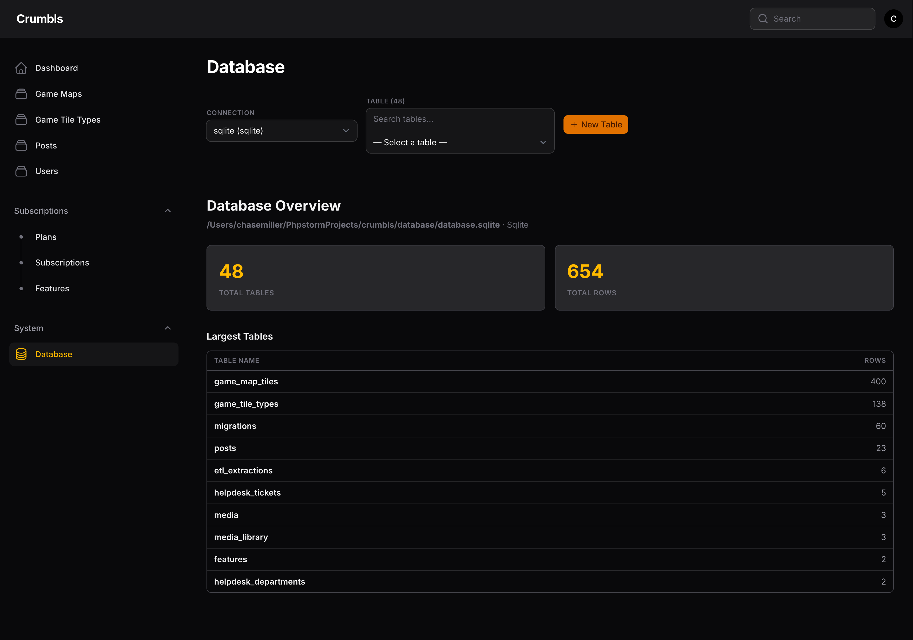
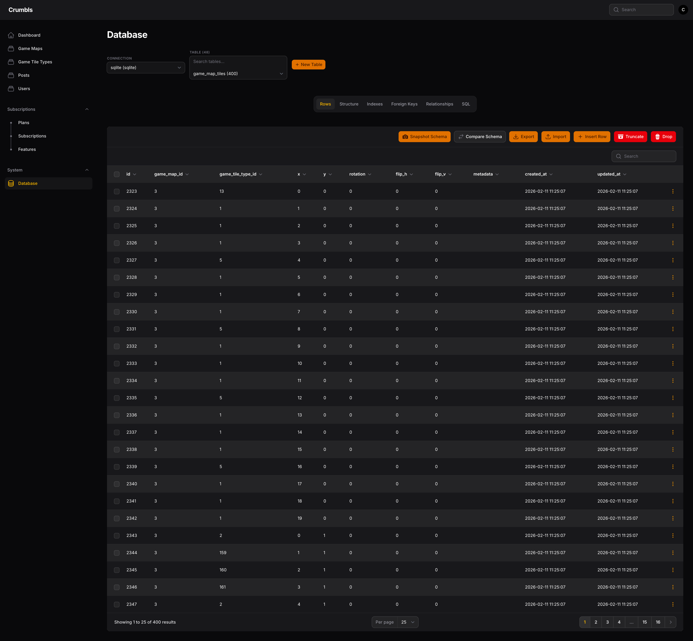

# Filament Database Administration

A phpMyAdmin-style database manager for [Laravel Filament](https://filamentphp.com). Browse tables, edit rows, manage schema, run SQL — all from your Filament admin panel.

| Requirement | Minimum Version |
|-------------|-----------------|
| PHP | 8.3             |
| Laravel | 12.0 – 13.x     |
| Filament | 5.0             |

## Screenshots

### Database Overview


### Table Browser


## Installation

```bash
composer require crumbls/filament-database
```

## Setup

Register the plugin in your Filament panel provider:

```php
use Crumbls\FilamentDatabase\FilamentDatabasePlugin;

public function panel(Panel $panel): Panel
{
    return $panel
        // ...
        ->plugins([
            FilamentDatabasePlugin::make()
                ->connections(['mysql'])
                ->authorize(function (): bool {
                    // You need to customize this. It controls who can view it.
                    return false;
                }),
        ]);
}
```

## Features

- **Database overview** — stats dashboard with table counts, row counts, and largest tables at a glance
- **Connection switcher** — hot-swap between database connections with health checking
- **Table browser** — searchable table list with row counts, one-click selection
- **Row CRUD** — paginated rows with sort, search, inline edit, insert, delete
- **Bulk operations** — select multiple rows for bulk delete or export
- **Copy row as** — copy any row as PHP array, JSON, SQL INSERT, or Laravel factory format
- **Structure viewer** — columns with types, nullable, defaults, and inline editing
- **Column management** — add, rename, modify, and drop columns
- **Index viewer** — all indexes with columns and uniqueness
- **Foreign key viewer** — constraints with ON UPDATE/DELETE actions
- **Relationships tab** — visual map of incoming and outgoing foreign key relationships
- **SQL runner** — execute raw queries with tabular results, query history, and Cmd/Ctrl+Enter shortcut
- **Query EXPLAIN** — EXPLAIN/ANALYZE support for MySQL, PostgreSQL, and SQLite
- **Schema snapshots** — capture your entire database schema as JSON, compare against previous snapshots with color-coded diffs
- **Migration generator** — generate Laravel migration code from schema diffs for review and download
- **Export** — download table data as CSV, JSON, or SQL INSERT statements
- **Import** — upload CSV files with automatic column mapping
- **Table operations** — create, truncate, drop tables with confirmation dialogs
- **Dark mode** — full support via Filament CSS variables
- **Audit logging** — optional query and change logging

## Configuration

Publish the config:

```bash
php artisan vendor:publish --tag=filament-database-config
```

The published configuration fails closed: no connections are allowed, database
writes are read-only, and the SQL runner is disabled until explicitly enabled.
Fluent plugin configuration overrides the corresponding published values for a
specific Filament panel.

### Plugin API

```php
FilamentDatabasePlugin::make()
    // Access control
    ->authorize(fn () => auth()->user()->is_admin)
    ->onlyForEmails(['admin@example.com'])

    // Connections
    ->connections(['mysql', 'sqlite'])
    ->excludeConnections(['pgsql'])
    ->defaultConnection('mysql')

    // Safety
    ->readOnly()
    ->preventDestructive()
    ->requireConfirmation()

    // Table visibility
    ->hideTables(['password_resets', 'failed_jobs'])
    ->showOnlyTables(['users', 'posts'])

    // SQL runner
    ->disableQueryRunner()
    ->queryRunnerReadOnly()

    // UI
    ->navigationGroup('System')
    ->navigationIcon('heroicon-o-circle-stack')
    ->navigationSort(100)
    ->navigationLabel('Database')
    ->rowsPerPage(25)
    ->maxRowsPerPage(500)

    // Audit
    ->logQueries()
    ->logChanges()
```

## Security

This package gives direct database access. **Access is denied to all users by default** — you must explicitly grant access via one of the authorization methods below.

### Authorization (required)

```php
// Closure — full control
FilamentDatabasePlugin::make()
    ->authorize(fn () => auth()->user()->is_admin)

// Laravel Gate
FilamentDatabasePlugin::make()
    ->authorizeUsing('manage-database')

// Email allowlist
FilamentDatabasePlugin::make()
    ->onlyForEmails(['admin@example.com'])
```

### Recommended production settings

```php
FilamentDatabasePlugin::make()
    ->authorize(fn () => auth()->user()->is_admin)
    ->readOnly()                          // block all writes
    ->preventDestructive()                // block DROP / TRUNCATE
    ->connections(['mysql'])              // limit to specific connections
    ->logQueries()                        // audit all SQL
    ->logChanges()                        // audit all data changes
```

Read-only SQL classification is defense in depth. Production read-only panels
should use database credentials without DML, DDL, file, function-execution, or
administrative privileges. Accepted read-only SQL runs in a read-only database
transaction on PostgreSQL and MySQL/MariaDB, or with SQLite `query_only` enabled.
The SQL runner is disabled whenever `hideTables()` or `showOnlyTables()` is set:
arbitrary SQL cannot safely enforce those table restrictions.

Read-only SQL has a five-second server-side timeout by default on PostgreSQL,
MySQL, and MariaDB. Set `sql_statement_timeout_ms` in the published config to
adjust it (maximum 60 seconds). SQLite and write-enabled SQL need database or
deployment-level execution limits. SQL result sets returned to Livewire are
capped at 500 rows.

CSV exports prefix common spreadsheet formula cells with a tab so Excel treats
them as text. Spreadsheet applications differ, and this changes those cell
values; use JSON or SQL export when exact values are required. Exports are
capped at 10,000 rows by default; configure
`max_export_rows` in the published config to change the cap. CSV import parses
and inserts in 500-row chunks rather than retaining the entire file in memory.

Row-level record and selection actions require a genuine single-column primary
key. Keyless and composite-key tables remain browse-only for existing records.

## Testing

```bash
composer test
```

177 tests, 390 assertions.

## License

MIT
